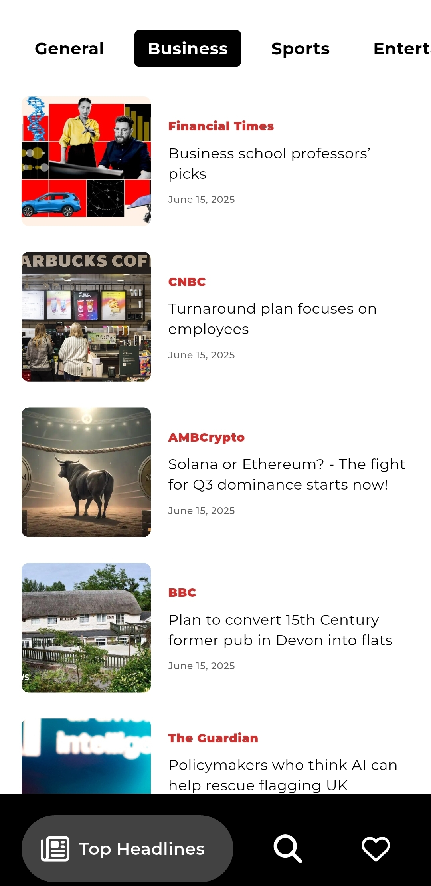
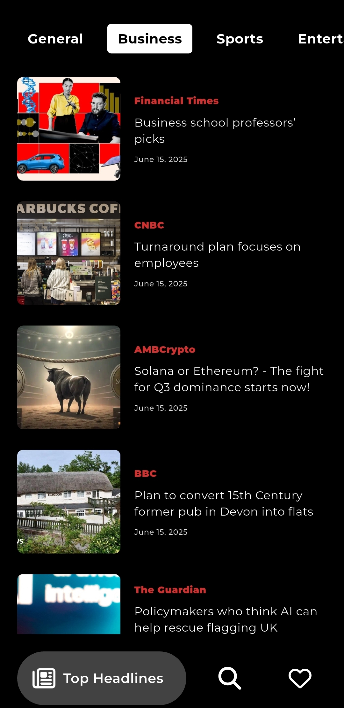

# News App

A Flutter news application built with BLoC for state management and following Clean Architecture principles. Stay informed with top headlines, search for the stories that matter most to you, and save articles for later reading.

## Features

- **Top Headlines**  
  Browse the latest and most important news from around the world.

- **Search Articles**  
  Look up news by keyword or topic to find exactly what you’re interested in.

- **Save & Manage Favorites**  
  Save articles to your personal reading list and remove them when you’re done.

## Architecture

This project follows **Clean Architecture**, organizing code into three core layers to promote separation of concerns:

1. **Presentation**  
   Handles UI and state management (e.g. BLoC, widgets, screens).

2. **Domain**  
   Encapsulates business rules and application logic (e.g. use cases, entity definitions, repository interfaces).

3. **Data**  
   Manages data operations, including remote API integration, local persistence, model mapping, and concrete repository implementations.

## API

This app uses the [GNews](https://gnews.io/) API. To get started:

1. Sign up at [GNews](https://gnews.io/) to obtain your free API key.  
2. In the project root, create a file named `.env` and add:
   ```dotenv
   BASE_URL=https://gnews.io/api/v4
   API_KEY=YOUR_API_KEY_HERE

## Screenshots

| Light                                     | Dark                                      |
| ----------------------------------------- | ----------------------------------------- |
|  |  |